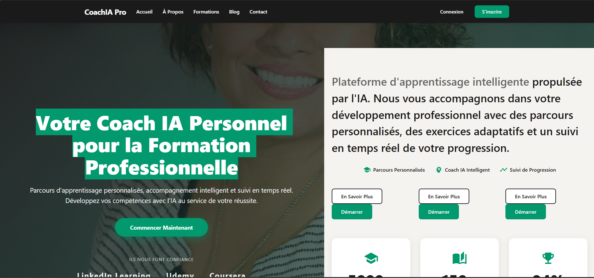
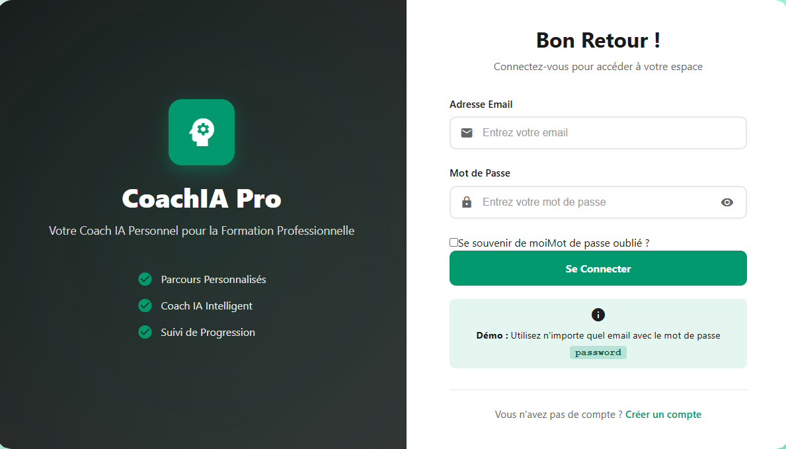
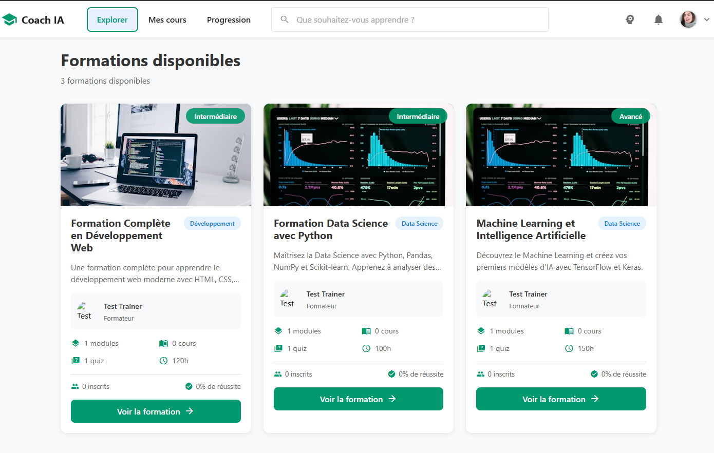
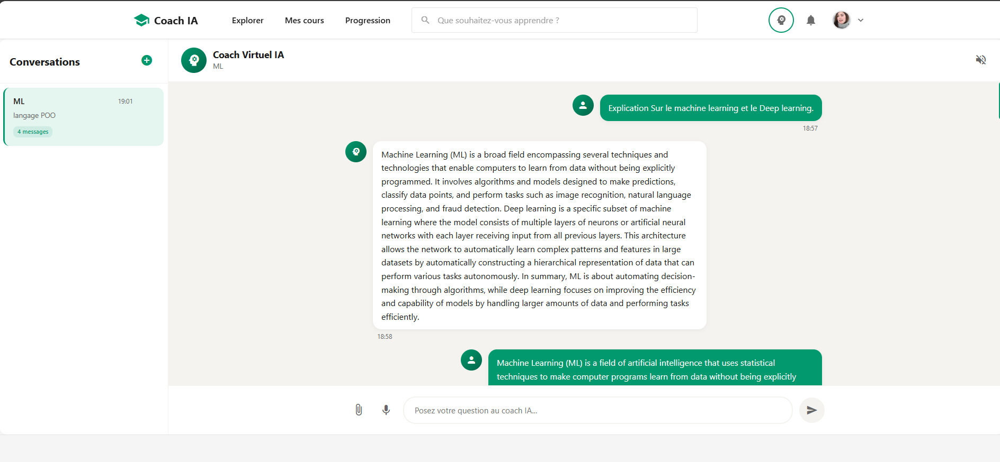
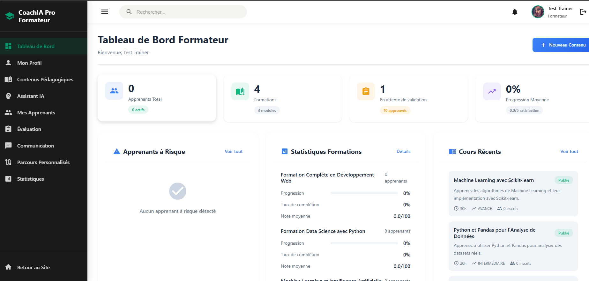
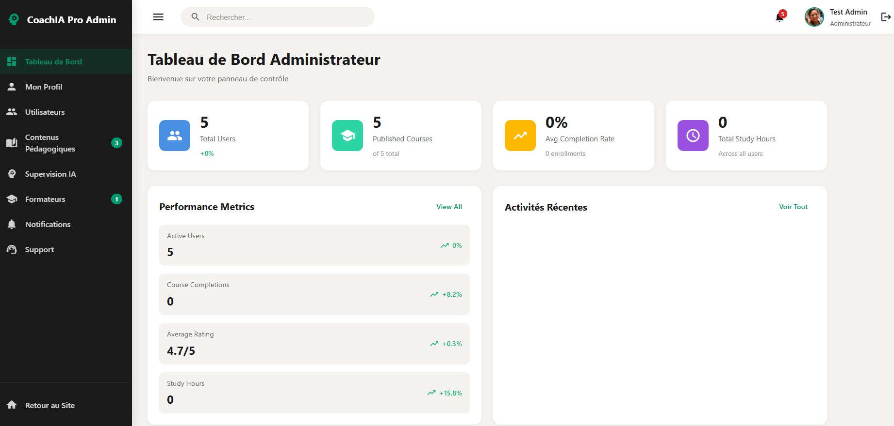

# CoachIA Pro

CoachIA Pro est une plateforme d'apprentissage intelligente propulsée par l'IA qui accompagne les apprenants dans leur développement professionnel. La plateforme propose des parcours personnalisés, un coach virtuel IA pour répondre aux questions, et un suivi en temps réel de la progression. Elle s'adresse aux apprenants, formateurs et administrateurs, chacun disposant d'un espace dédié adapté à ses besoins.

## Captures d'écran

### Page d'accueil

Page d'accueil présentant les fonctionnalités principales de la plateforme et les partenariats avec LinkedIn Learning, Udemy et Coursera.

### Page de connexion

Interface d'authentification avec formulaire de connexion et option d'inscription. Mode démo disponible avec n'importe quel email et le mot de passe "password".

### Catalogue des formations

Liste des formations disponibles avec filtres par niveau, catégorie et recherche. Affichage des statistiques et détails de chaque formation.

### Interface de chat avec le Coach IA

Chat interactif avec le coach virtuel IA pour poser des questions et recevoir des explications personnalisées. Historique des conversations accessible.

### Tableau de bord formateur

Vue d'ensemble des statistiques d'apprenants, formations et contenus. Gestion des apprenants à risque et création de contenus pédagogiques.

### Gestion des parcours personnalisés

Création et gestion de parcours personnalisés basés sur l'analyse ML. Recommandations automatiques selon le niveau et les intérêts détectés.

### Tableau de bord administrateur

Panneau de contrôle avec métriques globales : utilisateurs, cours, taux de complétion et performances de la plateforme.

### Gestion des contenus pédagogiques

Validation et gestion des contenus soumis par les formateurs. Système d'alerte pour les contenus en attente d'approbation.

## Technologies utilisées

### Backend
- **Spring Boot 3.2.0** - Framework Java pour le développement d'API REST
- **Java 17** - Langage de programmation
- **PostgreSQL** - Base de données relationnelle
- **Spring Security** - Authentification et autorisation
- **JWT (JSON Web Tokens)** - Gestion des sessions utilisateur
- **Maven** - Gestion des dépendances et build
- **Spring Data JPA** - Accès aux données

### Frontend
- **Angular 17** - Framework JavaScript pour applications web
- **TypeScript** - Langage de programmation typé
- **Angular Material** - Composants UI
- **RxJS** - Programmation réactive
- **Node.js / npm** - Gestion des dépendances

### Intelligence Artificielle
- **Python 3.13+** - Langage pour le Machine Learning
- **FastAPI** - Framework pour l'API du modèle ML
- **scikit-learn** - Bibliothèque de Machine Learning
- **Gradient Boosting** - Algorithme de prédiction
- **pandas / numpy** - Manipulation et analyse de données
- **joblib** - Sauvegarde et chargement des modèles
- **Ollama (qwen2.5:0.5b)** - Modèle de langage pour les réponses du coach IA
- **TF-IDF** - Vectorisation de texte

### Outils de développement
- **PostgreSQL** - Base de données (port 5433)
- **Maven** - Build et gestion des dépendances Java
- **npm** - Gestion des dépendances JavaScript
- **Git** - Contrôle de version

## Prérequis

Avant de lancer l'application, assurez-vous d'avoir installé :

- **Java 17** ou supérieur
- **Maven 3.6+**
- **Node.js 18+** et **npm**
- **Python 3.13+**
- **PostgreSQL** (port 5433)
- **Ollama** (pour le modèle de langage)

## Lancement du projet

### Option 1 : Lancement automatique (recommandé)

Utilisez le script PowerShell qui lance tous les services automatiquement :

```powershell
.\lancer_tous_services.ps1
```

Ce script va :
1. Créer la base de données PostgreSQL si elle n'existe pas
2. Appliquer le schéma SQL
3. Démarrer le service Python (modèle ML) sur le port 8000
4. Démarrer le backend Spring Boot sur le port 8081
5. Démarrer le frontend Angular sur le port 4200

### Option 2 : Lancement manuel

#### 1. Base de données PostgreSQL

```powershell
$env:PGPASSWORD = "ADMIN"
psql -h localhost -p 5433 -U postgres -d postgres -c "CREATE DATABASE coach_ai_db;"
psql -h localhost -p 5433 -U postgres -d coach_ai_db -f backend\sql\coach_virtual.sql
```

#### 2. Service Python (Modèle ML)

```powershell
python serve_model.py
```

Le service sera accessible sur **http://localhost:8000**

#### 3. Backend Spring Boot

```powershell
cd backend
mvn spring-boot:run
```

Ou si le JAR est déjà compilé :

```powershell
cd backend
java -jar target\coach-ai-0.0.1-SNAPSHOT.jar
```

Le backend sera accessible sur **http://localhost:8081/api**

#### 4. Frontend Angular

```powershell
cd coach_ai_frontend
npm install  # Si les dépendances ne sont pas installées
npm start
```

Le frontend sera accessible sur **http://localhost:4200**

## Lancement du modèle ML

### Installation des dépendances Python

```powershell
pip install -r requirements.txt
```

### Démarrer le service du modèle

Le modèle est servi via FastAPI. Pour le lancer :

```powershell
python serve_model.py
```

Le service démarre sur **http://localhost:8000** et expose les endpoints suivants :

- `GET /health` - Vérification de l'état du service
- `POST /coach/predict` - Prédiction du niveau de difficulté
- `POST /coach/hybrid` - Réponse combinée (modèle ML + Ollama)
- `POST /student/level/predict` - Prédiction du niveau d'étudiant
- `POST /topics/detect` - Détection des topics dans les conversations
- `POST /generate/quiz` - Génération de quiz
- `POST /generate/exercise` - Génération d'exercices

### Prérequis pour le modèle

Le modèle nécessite :
- **Ollama** installé et démarré avec le modèle `qwen2.5:0.5b`
- Les fichiers de modèle dans le dossier `models/`
- Les artefacts de preprocessing dans `processed_datasets/`

Pour installer Ollama et télécharger le modèle :

```bash
# Installer Ollama (voir https://ollama.ai)
ollama pull qwen2.5:0.5b
```

## URLs d'accès

Une fois tous les services démarrés :

- **Frontend** : http://localhost:4200
- **Backend API** : http://localhost:8081/api
- **Modèle ML** : http://localhost:8000
- **Documentation API** : http://localhost:8000/docs (FastAPI Swagger)

## Arrêt des services

Pour arrêter les services, vous pouvez :

1. Fermer les fenêtres de terminal où ils s'exécutent
2. Utiliser les fichiers `.pid` pour identifier et arrêter les processus :
   - `python_model.pid` - Service Python
   - `backend.pid` - Backend Spring Boot
   - `frontend.pid` - Frontend Angular

```powershell
# Arrêter un processus par son PID
Stop-Process -Id (Get-Content python_model.pid)
Stop-Process -Id (Get-Content backend.pid)
Stop-Process -Id (Get-Content frontend.pid)
```
